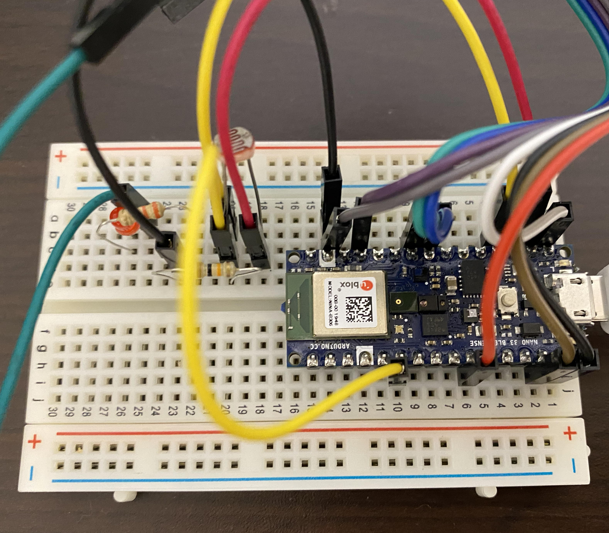
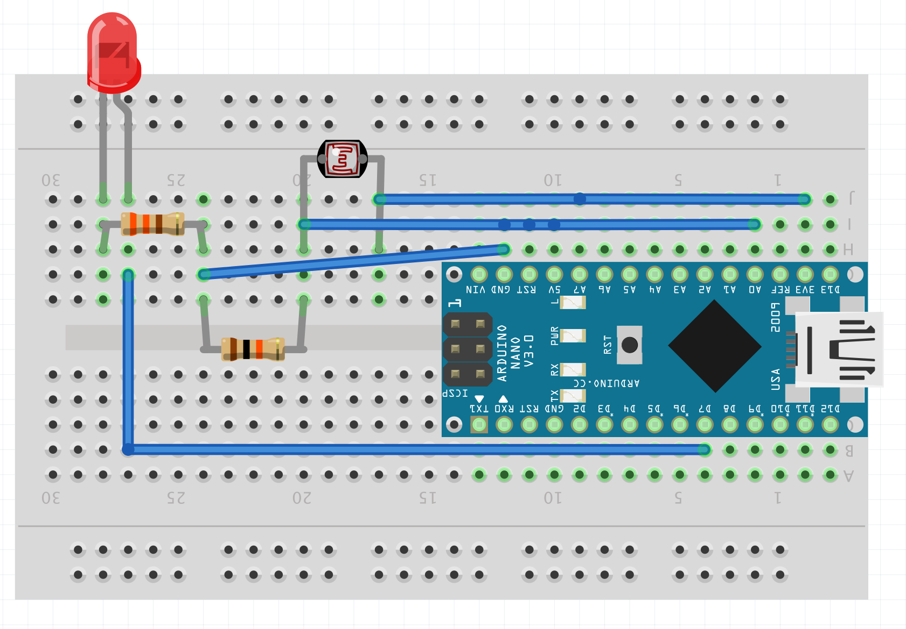

# ble-sensor-gateway
## Sensor device
Modify Peripheral/BatteryMonitor example in ArudiinoBLE library as `MyAdvertiser.ino`.
As an evaluation, the analogue input to A0 pin with 0-1023 is mapped to 0-9999 and turn on an LED attached to 7 pin in proportion to the value.



The 0-9999 value is divided by 100 and rounded down to the 1 and put to the 3rd byte in the Manufacturer data in BLE advertised packet, and the residual is put to the 4th byte. The adevertised packet with the values in Manufacturer data is periodically sent. 

## BLE gateway
Wiring between ENC28J60 ESP-WROOM-32D with reference to [ENC28J60を使ってESP32でEthernet UDP通信する](https://hikoleaf.hatenablog.jp/entry/2019/06/22/190914).


Modify WifiClient example in ESP-WROOM-32D library as `WiFiBLEClient.ino`.
The code scans BLE advertised packets with a few seconds interval and get the above values from Manufacture data with the MAC address of a sensor device, and then sends the values to a syslog server.
Syslog sendor setup is with reference to [Syslog](https://github.com/arcao/Syslog).

```
      std::string para = myOffset(str, 2);
      const char* param = "testapp";
      Serial.println(strcmp(para.c_str(), param));
//      syslog.appName((const char*)(para.c_str()));
      syslog.appName(param);  
```

In the code, we tried to copy the string input by serial console to an instance of std::string, but seems to touch a strange address, and then asking the syslog library creator how to fix as follows.

[How can we change const char* arguments during the application running?](https://github.com/arcao/Syslog/issues/25)

```
May  9 17:00:44 esp32 - 15:45:05:42:da:6c 1 67.339996 67.339996
May  9 17:00:51 esp32 - 15:45:05:42:da:6c 1 67.050003 67.050003
May  9 17:00:59 esp32 d8:9c:67:3a:98:14 15:45:05:42:da:6c 1 67.629997 67.629997
May  9 17:01:06 esp32 #002 15:45:05:42:da:6c 1 67.139999 67.139999
May  9 17:01:14 esp32 47:c6:10:36:97:82 15:45:05:42:da:6c 1 67.440002 67.440002
May  9 17:01:22 esp32 #002 15:45:05:42:da:6c 1 67.440002 67.440002
May  9 17:01:30 esp32 X??? 15:45:05:42:da:6c 1 67.339996 67.339996
```

## receive syslog
A syslog server receives the values as below.


```
May 16 13:41:49 esp32 - 15:45:05:42:da:6c 1 59.029999 59.029999
May 16 13:41:49 esp32 - 15:45:05:42:da:6c 1 60.110001 60.110001
May 16 13:41:57 esp32 - 15:45:05:42:da:6c 1 59.910000 59.910000
May 16 13:42:04 esp32 - 15:45:05:42:da:6c 1 59.910000 59.910000
May 16 13:42:11 esp32 - 15:45:05:42:da:6c 1 60.200001 60.200001
```

## put data to sqlite
To parse syslog and store to procesable data on sqlite3, the script `sl2sql.sh` is set to cron for scheduled execution.

```
sqlite> select * from sens_data;
280|15:45:05:42:da:6c|1|66.849998|66.849998|May 26 19:06:11|2021-05-26 21:00:03
281|15:45:05:42:da:6c|1|66.07|66.07|May 26 19:06:18|2021-05-26 21:00:03
282|15:45:05:42:da:6c|1|66.459999|66.459999|May 26 19:06:26|2021-05-26 21:00:03
283|15:45:05:42:da:6c|1|66.459999|66.459999|May 26 19:06:34|2021-05-26 21:00:03
```
