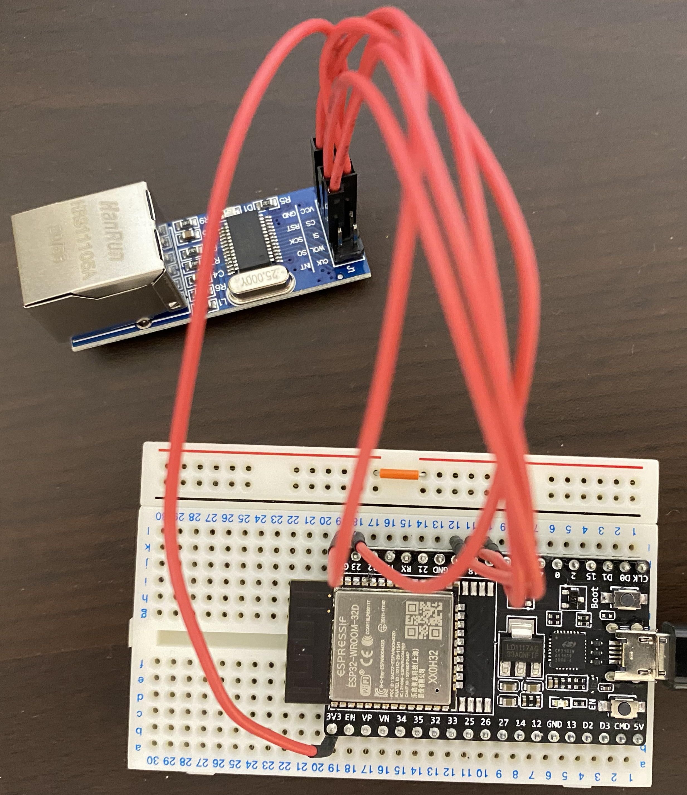

# ble-sensor-gateway
## Sensor device
Modify Peripheral/BatteryMonitor example in ArudiinoBLE library as `MyAdvertiser.ino`.
As an evaluation, the analogue input from SCT-013-100 to A0 pin with 0-1023 is mapped to 0-3300 mV and turn on an LED attached to 7 pin in proportion to the value. It's ranged between 1.20-4.02V under my environment as the following figure, and translated into the original AC current value according to [CT Sensors - Interfacing with an Arduino](https://learn.openenergymonitor.org/electricity-monitoring/ct-sensors/interface-with-arduino).
AC current = (A0 value - 5.22V\*461kΩ/(459kΩ+461kΩ))/20Ω\*2000turn/√2
The Bus voltage of INA219 is also monitored. INA219 library is installed with reference to [Arduino Code | Adafruit INA219 Current Sensor Breakout](https://learn.adafruit.com/adafruit-ina219-current-sensor-breakout/arduino-code).


The SCT-013-100 AC current is rounded down to the 1 and put to the 3rd byte in the Manufacturer data in BLE advertised packet, and the residual is put to the 4th byte. The INA219 Bus voltage and current are put as same. The adevertised packet with the values in Manufacturer data is periodically sent.

## BLE gateway
Wiring between ENC28J60 ESP-WROOM-32D with reference to [ENC28J60を使ってESP32でEthernet UDP通信する](https://hikoleaf.hatenablog.jp/entry/2019/06/22/190914).

As the following article wrote, the BLE library size is large and cannot co-exist with the WiFi library as default.
To solve this issue, delete OTA space and enlarge the program space as the article wrote, sorry for Japanese article.
- [https://ambidata.io/samples/m5stack/ble_gw/](https://ambidata.io/samples/m5stack/ble_gw/)



Modify WifiClient example in ESP-WROOM-32D library as `WiFiBLEClient.ino`.

The code scans BLE advertised packets with a few seconds interval and get the above values from Manufacture data with the MAC address of a sensor device, and then sends the values to a syslog server.
Syslog sendor setup is with reference to [Syslog](https://github.com/arcao/Syslog).

```
      std::string para = myOffset(str, 2);
      const char* param = "testapp";
      Serial.println(strcmp(para.c_str(), param));
//      syslog.appName((const char*)(para.c_str()));
      syslog.appName(param);  
```

In the code, we tried to copy the string input by serial console to an instance of std::string, but seems to touch a strange address, and then asking the syslog library creator how to fix as follows.

[How can we change const char* arguments during the application running?](https://github.com/arcao/Syslog/issues/25)

```
May  9 17:00:44 esp32 - 15:45:05:42:da:6c 1 67.339996 67.339996
May  9 17:00:51 esp32 - 15:45:05:42:da:6c 1 67.050003 67.050003
May  9 17:00:59 esp32 d8:9c:67:3a:98:14 15:45:05:42:da:6c 1 67.629997 67.629997
May  9 17:01:06 esp32 #002 15:45:05:42:da:6c 1 67.139999 67.139999
May  9 17:01:14 esp32 47:c6:10:36:97:82 15:45:05:42:da:6c 1 67.440002 67.440002
May  9 17:01:22 esp32 #002 15:45:05:42:da:6c 1 67.440002 67.440002
May  9 17:01:30 esp32 X??? 15:45:05:42:da:6c 1 67.339996 67.339996
```

## receive syslog
A syslog server receives the values as below. Currently we send three measured data.


```
Dec 12 13:02:35 esp32 - 15:45:05:42:da:a8 1 3.240000 0.230000 0.200000
Dec 12 13:02:43 esp32 - 15:45:05:42:da:a8 1 3.240000 -0.259995 0.100000
Dec 12 13:02:50 esp32 - 15:45:05:42:da:a8 1 3.250000 -0.690002 0.000000
Dec 12 13:02:57 esp32 - 15:45:05:42:da:a8 1 3.260000 -4.789993 0.000000
Dec 12 13:03:05 esp32 - 15:45:05:42:da:a8 1 3.250000 0.440000 0.200000
Dec 12 13:03:13 esp32 - 15:45:05:42:da:a8 1 3.240000 -3.229996 0.100000
Dec 12 13:03:20 esp32 - 15:45:05:42:da:a8 1 3.260000 -1.820007 0.100000
Dec 12 13:03:28 esp32 - 15:45:05:42:da:a8 1 3.250000 -4.580002 -0.100006
Dec 12 13:03:36 esp32 - 15:45:05:42:da:a8 1 3.240000 0.440000 0.100000
```

## put data to sqlite
To parse syslog and store to procesable data on sqlite3, the script `sl2sql.sh` is set to cron for scheduled execution.

```
sqlite> select * from sens_data;
234|15:45:05:42:da:a8|1|3.24|0.23|0.2|Dec 12 13:02:35|2021-12-12 13:03:39
235|15:45:05:42:da:a8|1|3.24|-0.259995|0.1|Dec 12 13:02:43|2021-12-12 13:03:39
236|15:45:05:42:da:a8|1|3.25|-0.690002|0.0|Dec 12 13:02:50|2021-12-12 13:03:40
237|15:45:05:42:da:a8|1|3.26|-4.789993|0.0|Dec 12 13:02:57|2021-12-12 13:03:40
238|15:45:05:42:da:a8|1|3.25|0.44|0.2|Dec 12 13:03:05|2021-12-12 13:03:41
239|15:45:05:42:da:a8|1|3.24|-3.229996|0.1|Dec 12 13:03:13|2021-12-12 13:03:41
240|15:45:05:42:da:a8|1|3.26|-1.820007|0.1|Dec 12 13:03:20|2021-12-12 13:03:41
241|15:45:05:42:da:a8|1|3.25|-4.580002|-0.100006|Dec 12 13:03:28|2021-12-12 13:03:41
242|15:45:05:42:da:a8|1|3.24|0.44|0.1|Dec 12 13:03:36|2021-12-12 13:03:42
```
